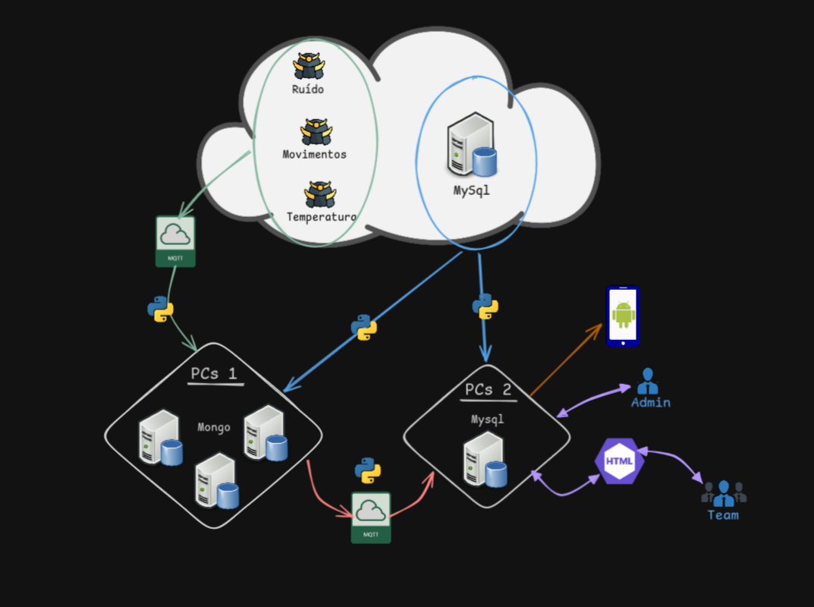

# PISID - Projeto Marsamis
<p align="center">
  
</p>

## How to run:

1. Start the docker container:
```bash
docker compose up -d
# or through Docker Desktop
```

2. Start our own python "bridge":

- From inside the dir `bridge/`
  - Create python virtual environment (First time only)
    ```bash
    python3 -m venv venv
    ```
  - Activate virtual environment   
    - Linux/Mac
      ```bash
      source venv/bin/activate
      ```
    - Windows
      ```bash
      ./venv/bin/Activate.ps1
      ```
  - Install python packages
    ```bash
    pip install -r requirements.txt
    ```
  - Start python program
    ```bash
    python3 main.py
    ```

3. Start mazerun program:

- On a separate window start the mazerun executable with **this flags**. Once inside the dir where the program is, do:
    - Windows
        ```bash
        mazerun.exe 25 --flagMessage 1 --delay 2 --broker broker.hivemq.com --portbroker 1883
        ```
    - Mac
        - Once inside the dir where the program is:
          ```bash
          ??? something similar to windows ???
          ```
> In the future you may want to change up the flags read more [here](#FLAGS).

---

## Project structure

This repo does not contain the executables for mazerun but they can be found here:

- Python Server (mazerun.exe)
    - Windows: https://moodle25.iscte-iul.pt/mod/resource/view.php?id=81634
    - Mac: https://moodle25.iscte-iul.pt/mod/resource/view.php?id=97340

- Monitor Graphs
    - https://drive.google.com/file/d/1Pa2VCf-GVV0hlso8wbAz2FQivbaIkMrX/view?usp=sharing

It is recommended to follow the following directory structure.
> /server and /analytics directories will and should not be tracked by git

```
mazerun/
├─ README.md
├─ config.yaml
├─ docker-compose.yml
│
├─ server/                 # Recommended: place for main exec
│   ├─ \_internals/
│   └─ mazerun.exe
│
├─ analytics/              # Recommended: place for graph execs
│   ├─ \_internals/
│   ├─ monitmaze.exe
│   ├─ monitsound.exe
│   ├─ monittemp.exe
│   └─ marsupilami_icon.png
│
└─ bridge/*                 # Python programs to move data
```

---

#### NOT WORKING, SAVE ME

- Make sure all this are running at the same time:
    - docker containers
        - use `docker ps` and check if containers are up
    - bridge/main.py
    - mazerun.exe (with the correct flags)

- Errors somewhere in `bridge/**` ?
    - Make sure you do `./venv/bin/activate.ps1` on Windows or `source venv/bin/activate/` on Linux/Mac, this activates the python virtual environment
    - Once in the python virtual environment, make sure you do `pip install -r requirements.txt`, this install all required packages
    - Check if bridge/config.yaml contains same info as your mazerun flags and docker-compose.yaml

- Network / MQTT
    - Internet must work
    - Try switching the broker (check online for other brokers)

---

#### FLAGS

- Explaining Flags for mazerun.exe:
    - 25 -> number of our group
    - flagMessage is used to selected what you want to see:
        - 1 -> sound, temp, movements, actuators
        - 2 -> movements
        - 3 -> sound
        - 4 -> temp
        - 5 -> actuators
    - delay -> time between movements
    - broker -> broker used for communication
    - portbroker -> broker port used

Example:
  ```bash
  25 --flagMessage 1 --delay 2 --broker broker.hivemq.com --portbroker 1883
  ```
